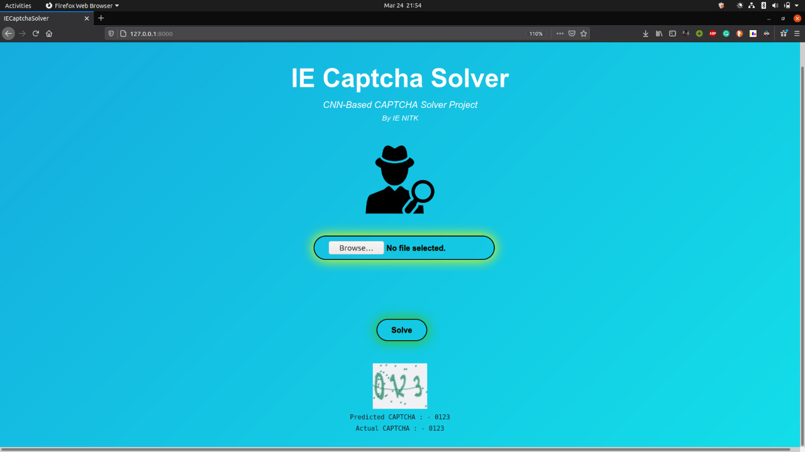
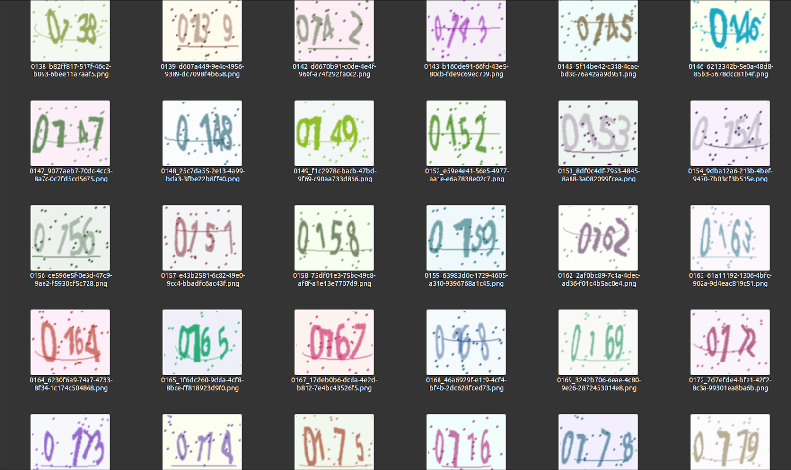
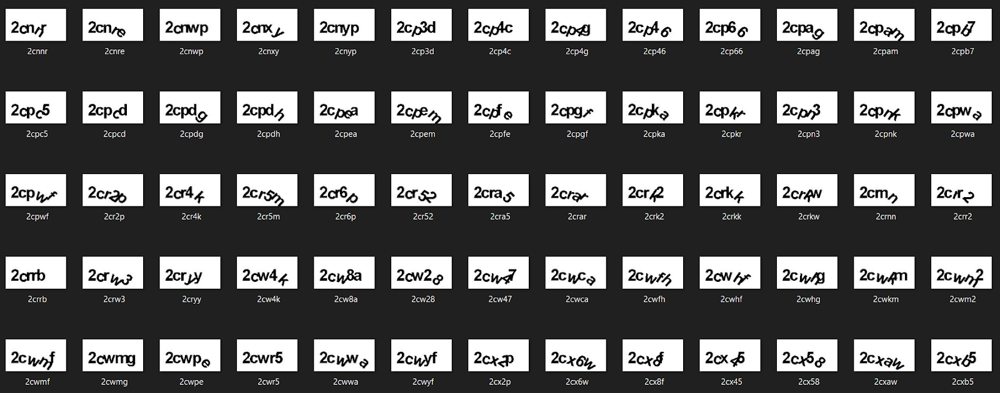
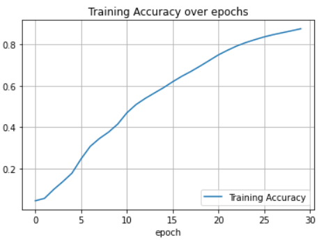
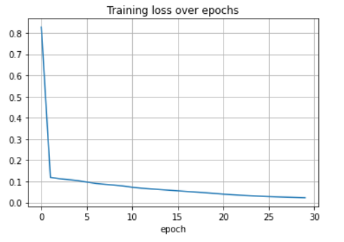

# IE.Recaptcha

A project made by students of [IE NITK](https://ie.nitk.ac.in/). Two CNNs are implemented in this model, one of them solves CAPTCHAs generated by Python's ImageCaptcha Library and the other model solves CAPTCHAs generated by JAVA's SimpleCaptcha Captcha Library.

#### Snapshot of WebApp

#### Python Captchas Using [captcha](https://pypi.org/project/captcha/)

#### Java Captchas Using [SimpleCaptcha](http://simplecaptcha.sourceforge.net/)

#### Custom CNN Architecture Performance

- The Model was trained on SimpleCaptcha Generated text-based CAPTCHAs

- The following plots were obtained : -
     
    - Training Accuracy over 30 Epochs = <b>87.55%</b>

    

    - Training Loss over 30 Epochs

    

<i>Made with</i> :heart:

<b>Mentors</b>
- [dwaipayon05](https://github.com/dwaipayan05)
- [Shreesha-B](https://github.com/Shreesha-B)

<b>Mentees</b>
- [thedragoncoder](https://github.com/thedragoncoder)
- [AK271](https://github.com/AK271)
